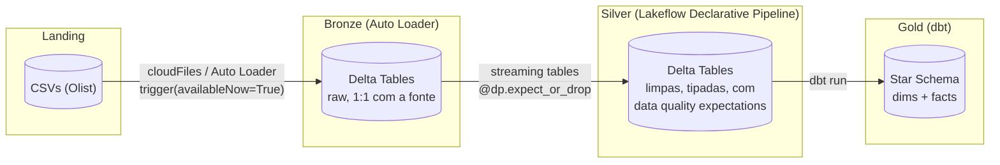
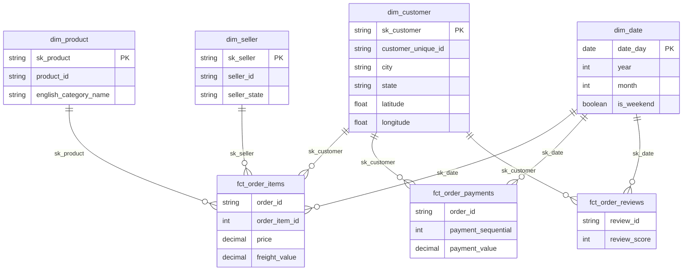

# E-commerce Lakehouse

Lakehouse de ponta a ponta sobre o dataset público [Olist Brazilian E-Commerce](https://www.kaggle.com/datasets/olistbr/brazilian-ecommerce), construído no Databricks com arquitetura medallion (landing → bronze → silver → gold), modelagem dimensional em dbt e deploy automatizado via GitHub Actions.

Projeto pessoal de estudo em Data Warehousing, Databricks e engenharia de dados moderna.

## Arquitetura



Cada camada usa um motor de execução diferente, orquestrados como jobs/pipeline separados no mesmo Databricks Asset Bundle:

| Camada | Como roda | O quê |
|---|---|---|
| **Landing → Bronze** | Spark Structured Streaming (Auto Loader, `cloudFiles`) | Um job Python por tabela, ingestão incremental dos CSVs, schema evolutivo |
| **Bronze → Silver** | Lakeflow Declarative Pipeline (serverless) | Streaming tables com `@dp.expect_or_drop` (data quality) e casts de tipo |
| **Silver → Gold** | dbt (`dbt-databricks`, SQL Warehouse serverless) | Star schema Kimball: 4 dimensões + 3 fact tables |

Um job orquestrador (`e_commerce_orchestrator_job`) encadeia as três etapas.

## Modelagem dimensional (gold)

Processo de negócio: **pedidos de e-commerce**. Grão da fact principal: **um item de pedido**.



Decisões de modelagem:
- **`int_geolocation`** agrega a geolocalização bruta (várias linhas por CEP) para 1 linha por `zip_code_prefix` e enriquece `dim_customer`/`dim_seller` com lat/lng — sem virar uma dimensão própria ligada à fact (evita snowflake).
- **`dim_customer`** é SCD1, com um **snapshot dbt separado** (`snp_dim_customers`, strategy `check`) preservando histórico de cidade/estado via SCD2.
- **Pagamentos e reviews são fact tables independentes** de `fct_order_items` — grãos diferentes (um pedido pode ter vários pagamentos; review é por pedido, não por item), evitando duplicar receita.

Cada modelo tem testes genéricos (`unique`, `not_null`, `relationships`, `accepted_values`, `dbt_utils.unique_combination_of_columns` para grão composto) e documentação de coluna em `_<model>.yml`.

## Stack

- **Databricks Asset Bundles (DAB)** — infraestrutura como código para jobs, pipeline, schemas e volumes (`databricks.yml`)
- **Delta Lake** — formato de tabela ACID por trás de todas as camadas
- **Auto Loader** — ingestão incremental de CSV (landing → bronze)
- **Lakeflow Declarative Pipelines** — streaming tables declarativas com data quality (bronze → silver)
- **dbt (dbt-databricks)** — star schema, snapshots SCD2, testes e documentação (silver → gold)
- **uv** — gerenciamento de dependências Python
- **pytest + Databricks Connect** — testes contra compute serverless real
- **ruff** — lint e formatação
- **GitHub Actions** — CI (lint + `bundle validate`) e CD (`bundle deploy` automático pra prod a cada merge em `main`)

## Estrutura do repositório

```
e_commerce_lakehouse/
├── databricks.yml                  # definição do bundle (targets dev/prod)
├── resources/
│   ├── jobs/                       # bronze job, silver pipeline, gold dbt job, orchestrator
│   └── infra/                      # schemas e volumes (Unity Catalog)
├── src/
│   ├── e_commerce_lakehouse/
│   │   ├── bronze/                 # 1 script por tabela (landing -> bronze)
│   │   └── silver/                 # 1 Lakeflow table por tabela (bronze -> silver)
│   └── pipelines/                  # LandingToBronze (Auto Loader helper)
├── dbt/data_warehouse/
│   ├── models/gold/                # dimensões + fatos (star schema)
│   └── snapshots/                  # SCD2 de dim_customer
└── tests/                          # pytest via Databricks Connect
```

## Rodando localmente

```bash
cd e_commerce_lakehouse
uv sync --dev
databricks configure                       # autentica no workspace
databricks bundle validate --target dev
databricks bundle deploy --target dev
uv run pytest                              # roda contra serverless compute real
```

## CI/CD

- **CI** (`ci.yml`): lint (`ruff check` + `ruff format --check`) e `databricks bundle validate` em todo PR pra `main`.
- **CD** (`cd.yml`): `databricks bundle deploy --target prod` a cada push em `main`.

## O que esse projeto exercitou

- Arquitetura medallion completa, com um motor de execução diferente (e apropriado) em cada camada — não só "três pastas com o mesmo código".
- Modelagem dimensional Kimball de verdade: grão explícito, chaves substitutas, degenerate dimensions, SCD1 vs SCD2, e as armadilhas específicas do dataset Olist (`orders.customer_id` ≠ `customer_unique_id`, fan-out em geolocalização).
- Debugging de problemas reais de dados em produção: parsing de CSV multi-linha corrompendo colunas, duplicação de dados por reprocessamento incorreto de streaming/checkpoint, MERGE ambíguo em snapshots SCD2 sem dedup.
- Infraestrutura como código (Databricks Asset Bundles) e pipeline de CI/CD completo, do zero.
