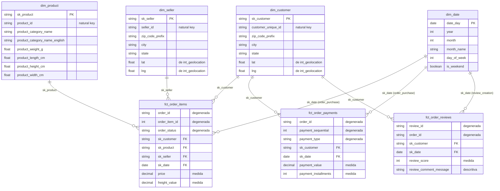
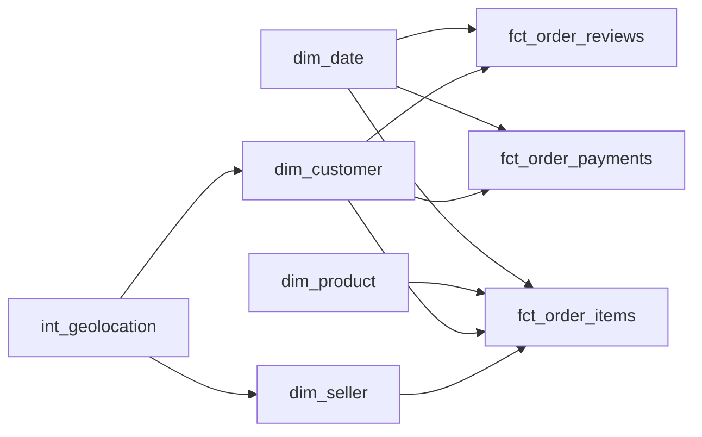

# Diagrama dimensional — Gold Layer (Star Schema)

> Acompanha [gold-star-schema-plan.md](gold-star-schema-plan.md). Este diagrama é o
> "mapa" do modelo; a checklist é o passo a passo de construção.

## Visão geral

## Notas de leitura do diagrama

- **`int_geolocation` não aparece como entidade própria** — ele é um modelo
  intermediário (zip_code_prefix → lat/lng médios) usado só para *enriquecer*
  `dim_customer` e `dim_seller` via join na hora de construir essas dimensões. Ele não é
  joinado diretamente pelas fact tables, por isso não tem uma linha de relacionamento no
  diagrama.
- **Três fact tables, grãos diferentes**: `fct_order_items` (1 linha = 1 item de pedido),
  `fct_order_payments` (1 linha = 1 pagamento de um pedido) e `fct_order_reviews` (1 linha
  = 1 avaliação). Elas não se juntam entre si diretamente — cada uma se conecta às
  dimensões compartilhadas (`dim_customer`, `dim_date`) de forma independente. Isso é
  esperado num modelo com múltiplos processos de negócio (fan-out trap se tentar juntar
  as três facts numa query só sem cuidado).
- **Campos "degenerada"** (`order_id`, `payment_sequential`, `review_id` etc.) ficam
  direto na fact table, sem dimensão própria — servem para agrupar/filtrar, mas não têm
  atributos descritivos adicionais que justifiquem uma dimensão separada.
- **`dim_date`** é referenciada por todas as facts, mas cada uma usa uma data de negócio
  diferente (compra, criação da review) — por isso o relacionamento tem um rótulo
  diferente em cada linha, mesmo sendo sempre a mesma dimensão fisicamente.

## Ordem sugerida de construção (bate com a checklist do plano)

Dimensões sem dependência (`dim_date`, `int_geolocation`, `dim_product`) podem ser
construídas em paralelo. `dim_customer`/`dim_seller` dependem de `int_geolocation`. As
três fact tables só fazem sentido depois que as dimensões que elas referenciam já
existirem.
